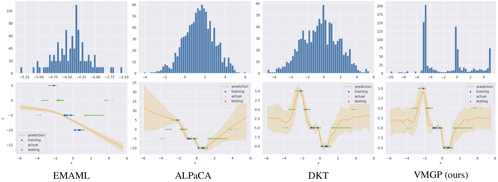
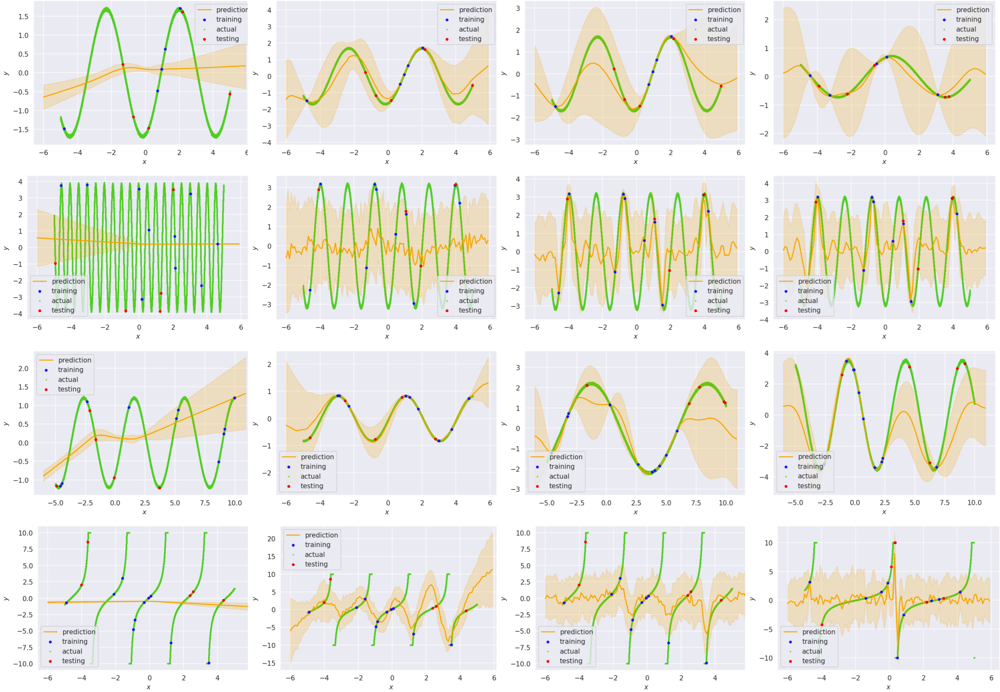

# vmgp
This is the repository of Vivek Myers and Nikhil Sardana for our [CS 330](https://cs330.stanford.edu/) final project, *Bayesian Meta-Learning Through Variational Gaussian Processes.*

Full paper: TBD

Above:  Predictions (bottom row) and posterior predictive distribution densities (for the single red testing point, top row)
from each model on a 5·floor(z) latent function task. VMGP is able to predict a multimodal mixture of point distributions to
model its uncertainty, outperforming the other, less expressive methods.

Above: Sinusoid Regression Examples. Columns, from left: EMAML, AlPaCA, DKT, VMGP (ours). Each row shows an example test
task from a different variant of the regression environment. Rows, from top: standard sinusoids, high frequency sinusoids, out of range testing, and tangent functions.
